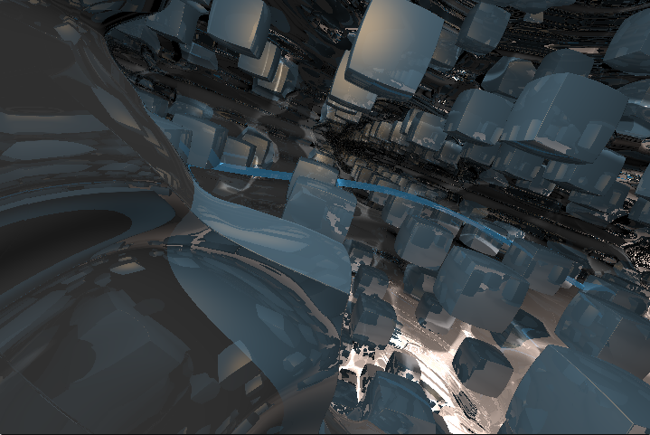
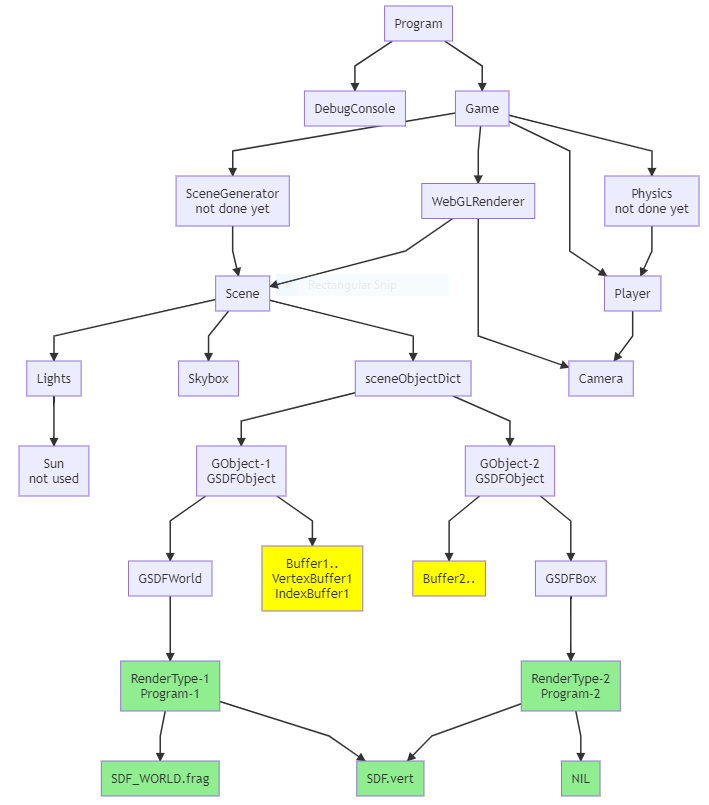

# LeapEngine
3D real-time front-end game-centered rendering engine using WebGL1.



Still in development... Not finished...

## Key Features
- Realtime Raymarching
  - Lightweight storage of scenes
  - Ultra-high definition surface finish, especially for close-ups
  - No triangular artefacts
  - Realistic lighting and shadows
  - Complete freedom of scene generation
  - Supports infinite scenes or fractals
- Time-based Animation
  - Supports time variable in shaders
  - Offers pallette function for time-based color changes
- Object Morphing and Combinition
  - Supports basic set operations
  - Supports fuzzy merging of nearby objects
- Hassle-free Manipulation of Views
  - Work with only the object space in your shaders
  - Transformations can be passed in via preset uniform vectors
- Adaptive FPS
  - FPS automatically self-adjusts until the stable value is reached
  - Update rate is automatically adjusted based on FPS
  - Supports recovery from a laggy state via the panic mechanism
- FPS controller
  - Supports rotation and translation of the camera
  - Camera positions and directions are procedurally calculated
- TO-DO: ECS structure for better extendability

## How to test?
- Online Server  
http://216.24.181.167/

- Local with python3 installed
    ```
    py3 -m http.server 8000
    ```
    then in brower go to http://localhost:8000

## Introduction of LeapEngine
### basic usage example of the WebGLRenderer class
```js
//This class conceals shader compilation and rendering process.
//read shader files.
await readShaderSourcesAsync(); 
//initialize renderer
let renderer = new WebGLRenderer(canvas, 600, 400);
//create scene
let scene = new Scene();
//create & add gameObject
scene.addObject(new XXX(....));
scene.addObject(new YYY(....));
...
//create camera
let camera = new Camera(Math.PI * 0.5, 600 / 400, 1, 1000);
//set camera eye
camera.setLookDirection([0, 0, 105], [0, 0, -1], [0, 1, 0]);
//render once
renderer.renderScene(scene, camera);
```
### basic usage example of the Game class
```js
//This class provides a customizable main loop for general games.
//initialize game
let game = new Game();
//set the reference to the window object
game.SetWindowOrRoot(window);
//create and add update function
function update(timestamp){...}
game.setUpdate(update);
//create and add draw function
function draw(){...}
game.setDraw(draw);
//create and add begin and end function (optional)
function begin(timestamp, framedelta){...}
function end(fps, panic){...}
game.setBegin(begin);
game.setEnd(end);
//start game
game.start();
```
### Runtime Data Structure

