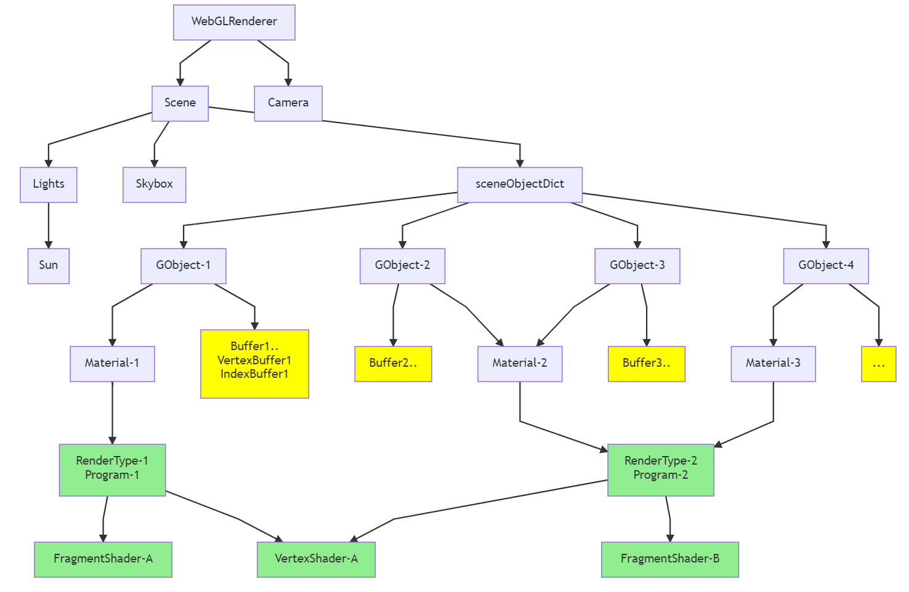

# LeapEngine
3D real-time rendering engine using WebGL.
Progress:
Learning WebGL

## how to run
- Online Server  
http://216.24.181.167/

- Local with python3 installed
    ```
    python3 -m http.server 8000
    ```
    then in brower go to http://localhost:8000

## Introduction of LeapEngine
### basic usage example
```js
//read shader files.
await readShaderSourcesAsync(); 
//initialize renderer
let renderer = new WebGLRenderer(canvas, 600, 400);
//create scene
let scene = new Scene();
//create & add gameObject
scene.addObject(new XXX(....));
scene.addObject(new YYY(....));
...
//create camera
let camera = new Camera(Math.PI * 0.5, 600 / 400, 1, 1000);
//set camera eye
camera.setLookDirection([0, 0, 105], [0, 0, -1], [0, 1, 0]);
//render once
renderer.renderScene(scene, camera);
```
### Runtime Data Structure of WebGLRenderer

- TODO: Lights / sun /skybox
- 每个游戏物体GObject绑定一个材质Material，多个物体可以共享一个Material.
- 每个Material都有指定的RenderType，所谓RenderType就是Shader Program.
- 多个Material可能对应同一个RenderType，它们使用相同的Shader Program渲染，但Shader参数不同(比如漫反射颜色不同)
- 每个Shader Program需要从一个Fragment Shader和一个Vertex Shader链接得到.
- 每个Fragment Shader或者Vertex Shader是从frag文件和vert文件编译得到的.
- 黄色和绿色是使用WebGL创建的对象，其余则是普通javascript对象.
- 绿色对象是Shader程序,在WebGLRenderer初始化时，自底向上编译并链接.
- 黄色对象是物体的顶点/索引/法线缓存等,在物体第一次被绘制时创建并缓存.

### Render workflow of WebGLRenderer
- 根据Camera计算视图/投影变换矩阵.
- 遍历游戏物体，对每个游戏物体：
  - 根据其Material对应的Program，切换所需的Shader Program.
  - 填充相机变换矩阵，以及游戏物体的变换矩阵.
  - TODO: 填充灯光数据等.
  - 填充材质参数(如颜色).
  - 绑定顶点/索引/法线缓存:
    - 如果缓存不存在，创建.
    - 对于SDF材质，会绑定专用的缓存（能绘制全屏的quad即可）.
  - 发起drawcall，绘制这一游戏物体.

### 添加新的Shader Program（新的材质，不是现有材质的参数化）
- 在material.js中:
  - `RENDER_TYPE` 添加一种新类型
  - `RENDER_PARAMS_BY_RENDER_TYPE`中写出这一shader program所需要的额外参数（默认的矩阵等参数之外的）。WebGLRenderer会尝试从Material对象或者GObject游戏物体对象上找同名参数.
  - `VERTEX_SHADER_FILE_BY_RENDER_TYPE` 指定这种Shader Program的vertex shader. 如果文件还不存在, 先在shaders下编写shader.
  - `FRAGMENT_SHADER_FILE_BY_RENDER_TYPE` 指定这种Shader Program的fragment shader. 如果文件还不存在, 先在shaders下编写shader.
  
如果希望某个`GObject`能够用创建的Shader Program绘制, 确保`GObject`上的属性或者`GObject.Material`上的属性,包含Shader Program需要的参数. 可修改或者新建`GObject`子类. 
